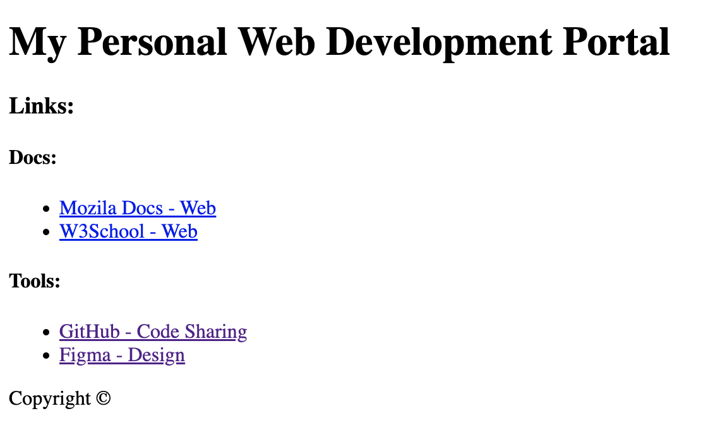

# Module 1
## Excercise

### Create Your own dashboard:

#### You will need these html tags:
* `<header>` ([Docs](https://developer.mozilla.org/en-US/docs/Web/HTML/Element/header))
* `<main>` ([Docs](https://developer.mozilla.org/en-US/docs/Web/HTML/Element/main))
* `<h1>,<h3>,<h4>` ([Docs](https://developer.mozilla.org/en-US/docs/Web/HTML/Element/Heading_Elements))
* `<footer>` ([Docs](https://developer.mozilla.org/en-US/docs/Web/HTML/Element/footer))
* `
` ([Docs](https://developer.mozilla.org/en-US/docs/Web/HTML/Element/p))
* `<a>` ([Docs](https://developer.mozilla.org/en-US/docs/Web/HTML/Element/a))
* Special characters: ([Docs](https://developer.mozilla.org/en-US/docs/Glossary/Entity))
    
    use `&copy;` for copyright symbol

### Take time and try to implement it by yourself. Once you feel done or stuck you can use the solution:

### [Solution](./Module-1-1-solution.html)

